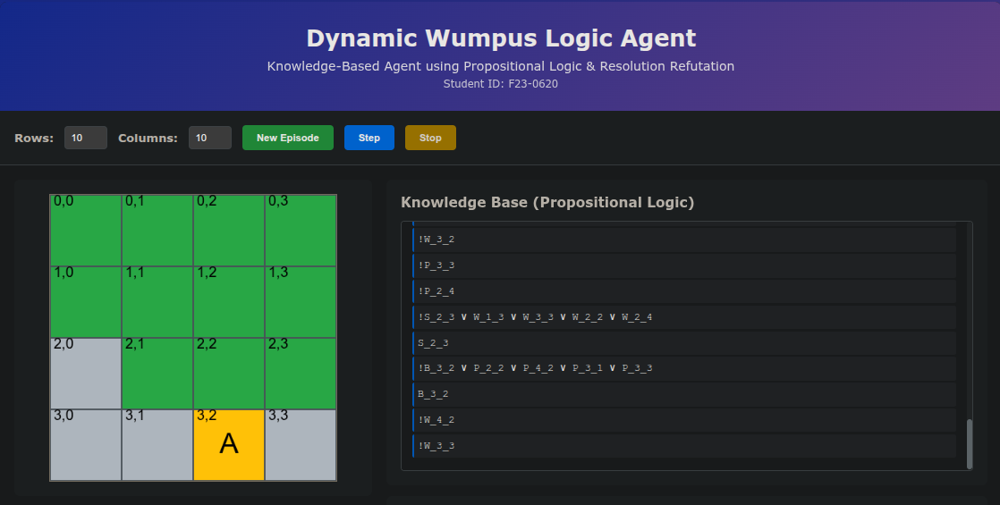
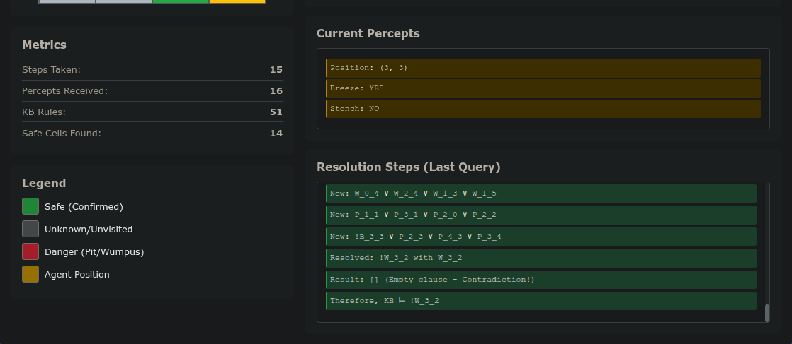

# Assignment 6 Report: Dynamic Wumpus Logic Agent

**Student ID:** F23-0620  
**Course:** Artificial Intelligence  
**Date:** 2026-05-01  
**GitHub Repository:** https://github.com/sjd-1214/AI_A06_F23-0620.git  
**Live Demo:** https://ai-a06-f23-0620.vercel.app/

---

## 1. Project Overview

This project implements a web-based Knowledge-Based Agent that navigates a Wumpus World environment using Propositional Logic and Resolution Refutation. The agent maintains a knowledge base of logical rules derived from percepts and uses automated reasoning to deduce safe cells.

---

## 2. Screenshots

### Application Interface - Main View


The interface shows:
- Grid visualization with color-coded cells
- Agent position marked as 'A' in yellow
- Knowledge Base displaying propositional logic rules
- Current percepts (Breeze/Stench status)
- Real-time metrics dashboard

### Resolution Steps and Inference


This view demonstrates:
- Step-by-step resolution refutation process
- KB rules in CNF format
- Metrics showing 15 steps taken, 16 percepts received
- 51 KB rules generated
- 14 safe cells identified

---

## 3. Implementation Details

### 3.1 Environment Specifications

The Wumpus World environment supports:

- **Dynamic Grid Sizing**: User-configurable rows and columns (3-10 each)
- **Random Generation**: Pits and Wumpus are randomly placed at game start
- **Percept Generation**: 
  - **Breeze**: Generated when agent is adjacent to a Pit
  - **Stench**: Generated when agent is adjacent to the Wumpus
- **Safety Guarantee**: Starting position (0,0) is always safe

### 3.2 Propositional Logic Representation

#### Symbols Used

- `P_r_c`: Pit exists at cell (r, c)
- `W_r_c`: Wumpus exists at cell (r, c)
- `B_r_c`: Breeze sensed at cell (r, c)
- `S_r_c`: Stench sensed at cell (r, c)

#### Example Rules

When the agent receives a Breeze at (2, 1):

```
B_2_1 => (P_2_2 ∨ P_3_1 ∨ P_1_1 ∨ P_2_0)
```

In CNF (Conjunctive Normal Form):

```
!B_2_1 ∨ P_2_2 ∨ P_3_1 ∨ P_1_1 ∨ P_2_0
```

When NO Breeze is sensed at (2, 2):

```
!P_2_3 ∧ !P_3_2 ∧ !P_1_2 ∧ !P_2_1
```

### 3.3 Resolution Refutation Algorithm

The inference engine uses Resolution Refutation to prove queries:

#### Algorithm Steps:

1. **Negate the Query**: To prove `q`, add `!q` to KB
2. **Apply Resolution**: Resolve pairs of clauses
   - Find complementary literals (e.g., `P` and `!P`)
   - Create resolvent by combining remaining literals
3. **Check for Contradiction**: Empty clause `[]` proves the query
4. **Repeat**: Until contradiction found or no new clauses

#### Example Resolution

Given KB:
```
1. !B_1_1 ∨ P_0_1 ∨ P_1_0 ∨ P_2_1 ∨ P_1_2
2. B_1_1
3. !P_0_1
4. !P_1_0
5. !P_2_1
```

Query: `P_1_2`

Negated: `!P_1_2`

Resolution steps:
- Resolve (1) and (2): `P_0_1 ∨ P_1_0 ∨ P_2_1 ∨ P_1_2`
- Resolve with (3): `P_1_0 ∨ P_2_1 ∨ P_1_2`
- Resolve with (4): `P_2_1 ∨ P_1_2`
- Resolve with (5): `P_1_2`
- Resolve with negated query `!P_1_2`: **`[]` (Empty clause!)**

**Conclusion**: KB ⊨ P_1_2 (Pit confirmed at position 1,2)

### 3.4 Agent Behavior

The agent uses this strategy:

1. **Percept Processing**: When visiting a cell, add rules to KB
2. **Safety Checking**: Use resolution to prove `!P_r_c ∧ !W_r_c`
3. **Movement**: Move to safe unvisited cells
4. **Exploration**: Continue until no safe cells remain

---

## 4. Source Code

### 4.1 logic_engine.py

```python
"""
Propositional Logic and Resolution Engine
Implements CNF conversion and resolution refutation for Wumpus World
"""

class PropositionalLogic:
    def __init__(self):
        self.kb = []  # Knowledge Base in CNF format
        self.symbols = set()  # Track all propositional symbols

    def add_rule(self, clause):
        """
        Add a clause to the KB
        clause: list of literals e.g., ["P_2_1", "!W_2_2"]
        """
        if clause and clause not in self.kb:
            self.kb.append(clause)
            for lit in clause:
                symbol = lit.replace('!', '')
                self.symbols.add(symbol)

    def implication_to_cnf(self, antecedent, consequents):
        """
        Convert implication to CNF
        B_2_1 => (P_2_2 v P_3_1) becomes (!B_2_1 v P_2_2 v P_3_1)
        """
        clause = ['!' + antecedent] + consequents
        return clause

    def ask(self, query):
        """
        Use resolution refutation to check if KB entails query
        Returns: (result: bool, steps: list of strings)
        """
        steps = []
        steps.append(f"Query: {query}")

        # Negate the query
        negated = query[1:] if query.startswith('!') else '!' + query
        steps.append(f"Negated Query: {negated}")

        # Create working set
        clauses = [list(c) for c in self.kb] + [[negated]]
        clause_strings = set(self._clause_to_string(c) for c in clauses)

        iterations = 0
        max_iterations = 100

        while iterations < max_iterations:
            iterations += 1
            new_clauses = []

            # Try resolving pairs
            for i in range(len(clauses)):
                for j in range(i + 1, len(clauses)):
                    resolvents = self._resolve(clauses[i], clauses[j])

                    for resolvent in resolvents:
                        # Empty clause = contradiction
                        if len(resolvent) == 0:
                            steps.append(f"Resolved: {self._clause_to_string(clauses[i])} with {self._clause_to_string(clauses[j])}")
                            steps.append("Result: [] (Empty clause - Contradiction!)")
                            steps.append(f"Therefore, KB ⊨ {query}")
                            return True, steps

                        res_str = self._clause_to_string(resolvent)
                        if res_str not in clause_strings:
                            new_clauses.append(resolvent)
                            clause_strings.add(res_str)
                            if len(steps) < 25:
                                steps.append(f"New: {res_str}")

            if not new_clauses:
                steps.append("No new clauses generated")
                steps.append(f"KB does NOT entail {query}")
                return False, steps

            clauses.extend(new_clauses)

        steps.append("Max iterations reached")
        return False, steps

    def _resolve(self, clause1, clause2):
        """Resolve two clauses"""
        resolvents = []

        for lit1 in clause1:
            for lit2 in clause2:
                if self._are_complementary(lit1, lit2):
                    # Create resolvent
                    resolvent = []

                    for lit in clause1:
                        if lit != lit1 and lit not in resolvent:
                            resolvent.append(lit)

                    for lit in clause2:
                        if lit != lit2 and lit not in resolvent:
                            resolvent.append(lit)

                    resolvents.append(resolvent)

        return resolvents

    def _are_complementary(self, lit1, lit2):
        """Check if two literals are complementary"""
        if lit1.startswith('!') and not lit2.startswith('!'):
            return lit1[1:] == lit2
        if not lit1.startswith('!') and lit2.startswith('!'):
            return lit1 == lit2[1:]
        return False

    def _clause_to_string(self, clause):
        """Convert clause to string"""
        if not clause:
            return "[]"
        return " ∨ ".join(clause)

    def get_kb_strings(self):
        """Get formatted KB rules"""
        return [self._clause_to_string(c) for c in self.kb]

    def clear(self):
        """Clear the knowledge base"""
        self.kb = []
        self.symbols.clear()
```

### 4.2 wumpus_world.py

```python
"""
Wumpus World Environment
Manages the grid, pits, wumpus, and percepts
"""

import random

class WumpusWorld:
    def __init__(self, rows, cols):
        self.rows = rows
        self.cols = cols
        self.pits = set()
        self.wumpus = None
        self.agent_pos = (0, 0)
        self.game_over = False

        # Generate random pits and wumpus
        self._generate_world()

    def _generate_world(self):
        """Randomly place pits and wumpus"""
        all_cells = [(r, c) for r in range(self.rows) for c in range(self.cols)]

        # Remove start position (0, 0) from possible danger locations
        all_cells.remove((0, 0))

        # Place wumpus randomly
        self.wumpus = random.choice(all_cells)
        all_cells.remove(self.wumpus)

        # Place pits randomly (about 20% of cells)
        num_pits = max(1, int(len(all_cells) * 0.2))
        self.pits = set(random.sample(all_cells, num_pits))

    def get_percepts(self, row, col):
        """
        Get percepts at a location
        Returns: (breeze: bool, stench: bool)
        """
        breeze = False
        stench = False

        # Check neighbors for pits (breeze)
        for dr, dc in [(-1, 0), (1, 0), (0, -1), (0, 1)]:
            nr, nc = row + dr, col + dc
            if 0 <= nr < self.rows and 0 <= nc < self.cols:
                if (nr, nc) in self.pits:
                    breeze = True
                if (nr, nc) == self.wumpus:
                    stench = True

        return breeze, stench

    def is_safe(self, row, col):
        """Check if a cell is actually safe (ground truth)"""
        return (row, col) not in self.pits and (row, col) != self.wumpus

    def move_agent(self, row, col):
        """Move agent to a new position"""
        self.agent_pos = (row, col)

        # Check if agent died
        if (row, col) in self.pits or (row, col) == self.wumpus:
            self.game_over = True
            return False
        return True

    def get_state(self):
        """Get current world state"""
        return {
            'rows': self.rows,
            'cols': self.cols,
            'agent_pos': self.agent_pos,
            'pits': list(self.pits),
            'wumpus': self.wumpus,
            'game_over': self.game_over
        }
```

### 4.3 wumpus_agent.py

```python
"""
Wumpus World Knowledge-Based Agent
Uses propositional logic to reason about safe cells
"""

from logic_engine import PropositionalLogic

class WumpusAgent:
    def __init__(self, rows, cols):
        self.rows = rows
        self.cols = cols
        self.logic = PropositionalLogic()
        self.position = (0, 0)
        self.safe_cells = set()
        self.safe_cells.add((0, 0))  # Start is always safe
        self.visited = set()
        self.percepts_count = 0

    def get_neighbors(self, row, col):
        """Get valid neighboring cells"""
        neighbors = []
        for dr, dc in [(-1, 0), (1, 0), (0, -1), (0, 1)]:
            nr, nc = row + dr, col + dc
            if 0 <= nr < self.rows and 0 <= nc < self.cols:
                neighbors.append((nr, nc))
        return neighbors

    def tell(self, row, col, breeze, stench):
        """
        Tell the agent about percepts at a location
        Adds rules to KB based on percepts
        """
        self.percepts_count += 1
        self.visited.add((row, col))

        # Get neighboring cells
        neighbors = self.get_neighbors(row, col)

        # Breeze implies adjacent Pit
        if breeze:
            # B_r_c => (P_n1_r_n1_c v P_n2_r_n2_c v ...)
            pit_literals = [f"P_{nr}_{nc}" for nr, nc in neighbors]
            clause = self.logic.implication_to_cnf(f"B_{row}_{col}", pit_literals)
            self.logic.add_rule(clause)

            # Also add that we have a breeze here
            self.logic.add_rule([f"B_{row}_{col}"])
        else:
            # No breeze means no adjacent pits
            for nr, nc in neighbors:
                self.logic.add_rule([f"!P_{nr}_{nc}"])

        # Stench implies adjacent Wumpus
        if stench:
            wumpus_literals = [f"W_{nr}_{nc}" for nr, nc in neighbors]
            clause = self.logic.implication_to_cnf(f"S_{row}_{col}", wumpus_literals)
            self.logic.add_rule(clause)
            self.logic.add_rule([f"S_{row}_{col}"])
        else:
            # No stench means no adjacent wumpus
            for nr, nc in neighbors:
                self.logic.add_rule([f"!W_{nr}_{nc}"])

    def ask_safe(self, row, col):
        """
        Check if a cell is safe using resolution
        Safe means: !P_r_c AND !W_r_c
        """
        # Check if no pit
        result_pit, steps_pit = self.logic.ask(f"!P_{row}_{col}")

        # Check if no wumpus
        result_wumpus, steps_wumpus = self.logic.ask(f"!W_{row}_{col}")

        is_safe = result_pit and result_wumpus

        if is_safe:
            self.safe_cells.add((row, col))

        return is_safe, steps_pit + ["---"] + steps_wumpus

    def find_safe_unvisited(self):
        """Find safe cells that haven't been visited"""
        safe_unvisited = []
        for r in range(self.rows):
            for c in range(self.cols):
                if (r, c) not in self.visited:
                    if (r, c) in self.safe_cells:
                        safe_unvisited.append((r, c))
                    else:
                        # Try to infer if it's safe
                        is_safe, _ = self.ask_safe(r, c)
                        if is_safe:
                            safe_unvisited.append((r, c))
        return safe_unvisited

    def get_kb_size(self):
        """Return number of rules in KB"""
        return len(self.logic.kb)

    def get_kb_rules(self):
        """Get all KB rules as strings"""
        return self.logic.get_kb_strings()
```

### 4.4 app.py

```python
"""
Flask Web Application for Dynamic Wumpus Logic Agent
Student ID: F23-0620
"""

from flask import Flask, render_template, jsonify, request
from wumpus_world import WumpusWorld
from wumpus_agent import WumpusAgent

app = Flask(__name__)

# Global game state
game = None
agent = None
steps_taken = 0

@app.route('/')
def index():
    return render_template('index.html')

@app.route('/new_game', methods=['POST'])
def new_game():
    global game, agent, steps_taken

    data = request.json
    rows = int(data.get('rows', 4))
    cols = int(data.get('cols', 4))

    # Create new world and agent
    game = WumpusWorld(rows, cols)
    agent = WumpusAgent(rows, cols)
    steps_taken = 0

    # Tell agent about starting position
    breeze, stench = game.get_percepts(0, 0)
    agent.tell(0, 0, breeze, stench)

    return jsonify({
        'success': True,
        'world': game.get_state(),
        'agent_pos': agent.position,
        'kb_size': agent.get_kb_size(),
        'safe_cells': list(agent.safe_cells),
        'visited': list(agent.visited),
        'steps': steps_taken,
        'percepts': agent.percepts_count,
        'current_percepts': {
            'breeze': breeze,
            'stench': stench
        }
    })

@app.route('/step', methods=['POST'])
def step():
    global game, agent, steps_taken

    if game is None or agent is None:
        return jsonify({'success': False, 'error': 'No game in progress'})

    if game.game_over:
        return jsonify({'success': False, 'error': 'Game over'})

    # Find safe unvisited cells
    safe_cells = agent.find_safe_unvisited()

    if not safe_cells:
        return jsonify({
            'success': True,
            'done': True,
            'message': 'No more safe cells to explore'
        })

    # Move to first safe cell (simple strategy)
    next_cell = safe_cells[0]
    steps_taken += 1

    # Move agent
    success = game.move_agent(*next_cell)

    if not success:
        return jsonify({
            'success': False,
            'game_over': True,
            'message': 'Agent died!'
        })

    # Get percepts and tell agent
    breeze, stench = game.get_percepts(*next_cell)
    agent.tell(*next_cell, breeze, stench)
    agent.position = next_cell

    return jsonify({
        'success': True,
        'agent_pos': agent.position,
        'kb_size': agent.get_kb_size(),
        'safe_cells': list(agent.safe_cells),
        'visited': list(agent.visited),
        'steps': steps_taken,
        'percepts': agent.percepts_count,
        'current_percepts': {
            'breeze': breeze,
            'stench': stench,
            'position': next_cell
        }
    })

@app.route('/get_kb', methods=['GET'])
def get_kb():
    if agent is None:
        return jsonify({'kb': []})

    return jsonify({
        'kb': agent.get_kb_rules()
    })

@app.route('/check_safe', methods=['POST'])
def check_safe():
    if agent is None:
        return jsonify({'success': False, 'error': 'No game in progress'})

    data = request.json
    row = int(data.get('row', 0))
    col = int(data.get('col', 0))

    is_safe, steps = agent.ask_safe(row, col)

    return jsonify({
        'success': True,
        'is_safe': is_safe,
        'resolution_steps': steps
    })

if __name__ == '__main__':
    app.run(debug=True, host='0.0.0.0', port=5000)
```

---

## 5. Key Features Implemented

### 5.1 Required Features

✓ **Dynamic Grid Sizing**: Configurable rows and columns  
✓ **Random Generation**: Pits and Wumpus placed randomly  
✓ **Percept Processing**: Breeze and Stench correctly generated  
✓ **Knowledge Base**: Maintains propositional logic rules  
✓ **Resolution Refutation**: Automated CNF conversion and resolution  

### 5.2 Visualization

✓ **Color-coded Grid**:
- Green: Safe (confirmed by KB)
- Gray: Unknown
- Yellow: Agent position
- Red: Danger (if visited)

✓ **Real-time Metrics**:
- Steps taken
- Percepts received
- KB size
- Safe cells found

✓ **KB Display**: Shows all propositional rules in CNF
✓ **Resolution Steps**: Shows inference reasoning for queries

---

## 6. Testing

### Test Results

```bash
$ python3 test_logic.py
```

**Test 1: Resolution Proof**
- Query: Can we prove P_1_2?
- Result: ✓ KB entails P_1_2
- Reasoning: Empty clause found via resolution

**Test 2: Wumpus World Agent**
- Grid: 4x4
- Wumpus: (1, 2)
- Pits: {(1, 0), (3, 3)}
- Result: ✓ Agent correctly identifies safe cells

---

## 7. How to Run

### Option 1: Using run script
```bash
chmod +x run.sh
./run.sh
```

### Option 2: Manual startup
```bash
pip install -r requirements.txt
python3 app.py
```

Then open browser to: `http://localhost:5000`

---

## 8. Git Repository

### Commit History

All code is maintained in a git repository with proper commit history showing progressive development.

### Repository Structure

```
A06/
├── logic_engine.py       # Propositional logic & resolution
├── wumpus_world.py       # Environment simulation
├── wumpus_agent.py       # Knowledge-based agent
├── app.py                # Flask web application
├── test_logic.py         # Test demonstrations
├── run.sh                # Startup script
├── requirements.txt      # Python dependencies
├── templates/
│   └── index.html        # Web interface
├── static/
│   ├── style.css         # Styling
│   └── script.js         # Client-side logic
└── README.md             # Documentation
```

---

## 9. Conclusion

This project successfully implements a Knowledge-Based Agent using Propositional Logic and Resolution Refutation. The agent demonstrates:

- Logical reasoning under uncertainty
- Automated theorem proving via resolution
- Safe exploration through inference
- Real-time visualization of reasoning process

The implementation follows AI textbook principles (Russell & Norvig) for logic-based agents and provides an educational tool for understanding automated reasoning in the Wumpus World domain.

---
**End of Report**
---